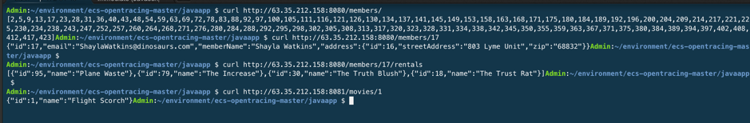

## Opentracing of a Java application on ECS
Opentracing of Java apps using Spring Boot and Sparkjava with Docker, running on Amazon ECS, using Opentracing with Jaeger. **This is based on the project by https://github.com/mikelduke/opentracing-java-demo** Two Java services, members and vhs-catalog, run in two Docker containers and Jaeger runs in another container on ECS, as part of a single ECS Task. 

This demo assumes that everything is being deployed in **eu-west-1** AWS Region. This demo uses the **jaegertracing/all-in-one** Docker image, where all components run in a single container. Jaeger also supports Cassandra 3.x, ElasticSearch as persistent storage.

The Spring Boot members app calls the Sparkjava vhs-catalog service to look up movie names rented by the customer.

## Instructions

## Build the project
Build both projects using gradle, then build docker containers.
```
cd javaapp
chmod +x ./members/gradlew
chmod +x ./vhs-catalog/gradlew

./build.sh
```
## Create the ECR repositories and push the docker images for members and vhs-catalog 

```
aws ecr create-repository --region eu-west-1 --repository-name members
aws ecr create-repository --region eu-west-1 --repository-name vhs-catalog
```
  
**Run the following command and run docker login command that was returned in the previous step. You should get a Login succeeded message. Refer https://docs.aws.amazon.com/AmazonECR/latest/userguide/docker-basics.html**
```
aws ecr get-login --no-include-email --region eu-west-1
```

**Push the docker images to ECR** 

```
export ACCOUNT_ID=$(aws sts get-caller-identity --output text --query Account)
echo $ACCOUNT_ID

docker tag members:latest ${ACCOUNT_ID}.dkr.ecr.eu-west-1.amazonaws.com/members:latest
docker push ${ACCOUNT_ID}.dkr.ecr.eu-west-1.amazonaws.com/members:latest

docker tag vhs-catalog:latest ${ACCOUNT_ID}.dkr.ecr.eu-west-1.amazonaws.com/vhs-catalog:latest
docker push ${ACCOUNT_ID}.dkr.ecr.eu-west-1.amazonaws.com/vhs-catalog:latest
```
## Register the task definition with ECS

**Note: Update the [jaeger-task-definition-javaapp.json](https://github.com/aws-samples/ecs-opentracing/blob/master/javaapp/jaeger-task-definition-javaapp.json) file and replace "awsaccountid" with the AWS account id, for members and vhs-catalog images .**
  
```
aws ecr describe-repositories --region eu-west-1
aws ecs register-task-definition --region eu-west-1 --cli-input-json file://jaeger-task-definition-javaapp.json
aws ecs list-task-definitions --region eu-west-1
aws ecs list-clusters --region eu-west-1
```

## Create a Cloudwatch log group (if you have previously not created a log group called ecs-log-streaming) and Run the Task on ECS
```
aws logs create-log-group --region eu-west-1 --log-group-name ecs-log-streaming2
aws ecs run-task --cluster ecs-opentracing-jaeger  --task-definition jaeger-stack2 --count 1 --region eu-west-1
```


## Test the applications
**Note: Make sure security groups are open for Inbound for the Jaeger and Application TCP ports:8000,8081,16686 in the EC2 instance of the ECS Cluster and your internet proxy allows access to these ports in your workplace.**

```
Get the IP address of the running task
ecs-cli ps --region eu-west-1

Access the Application to generate some tracing data -
curl http://<<IP address of the Task>>:8080/members/
curl http://<<IP address of the Task>>:8080/members/2/rentals
curl http://<<IP address of the Task>>:8081/movies/1
```


**Access the Jaeger console on a browser - http://{IP address  of the Task}:16686**


## Clean up
1. Delete the Amazon ECS Cluster from the AWS management console or via AWS CLI as per http://docs.aws.amazon.com/AmazonECS/latest/developerguide/delete_cluster.html
2. Delete the EC2 instance launched via the ECS Cluster
2. Delete the Repository from the AWS management ECR console or via AWS CLI
3. Delete Cloudwatch log group
```
aws logs delete-log-group --log-group-name ecs-log-streaming2
```
