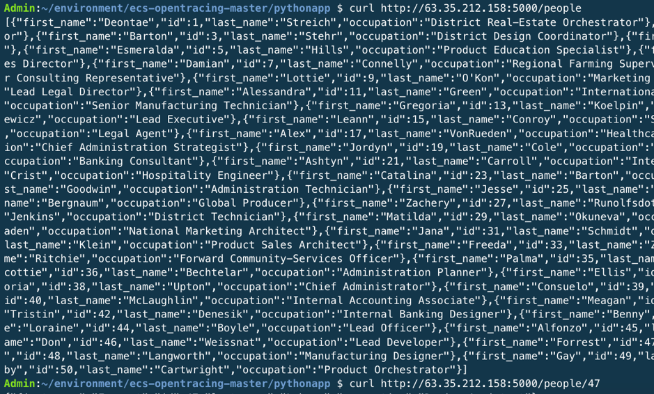
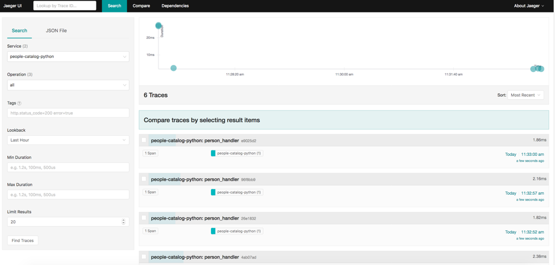

## Opentracing of a Python application using Jaeger on Amazon ECS
**The Python app is based on **https://github.com/bryanl/apptracing-py** with changes to make it completely Dockerized. The Python web application running on ECS in multiple Docker containers and uses various python modules like flask, jaeger-client,a Postgresql database and Jaeger. 

This demo assumes that everything is being deployed in **eu-west-1** AWS Region. This demo uses the **jaegertracing/all-in-one** Docker image, where all Jaeger components run in a single container. Jaeger also supports Cassandra 3.x, ElasticSearch as persistent storage.


## Instructions

**Note: The following instructions assume that the ECS Cluster has been setup as per the Prerequisites**

## Create an Amazon Elastic Container Registry (ECR) repository for the Microservices
Using the AWS management console or AWS CLI, create two ECR Registry entries: **psql-data** and **jaegerapp** to store the Docker images.

```
aws ecr create-repository --region eu-west-1 --repository-name psql-data
aws ecr create-repository --region eu-west-1 --repository-name jaegerapp
```

## Build and push the Database image to ECR
```
cd pythonapp
cd db
```
  
**Run the following command and run docker login command that was returned in the previous step. You should get a Login succeeded message. Refer https://docs.aws.amazon.com/AmazonECR/latest/userguide/docker-basics.html**

```
aws ecr get-login --no-include-email --region eu-west-1
```

## Build and push the database with sample data image to ECR

```
export ACCOUNT_ID=$(aws sts get-caller-identity --output text --query Account)
echo $ACCOUNT_ID

docker build -t psql-data .
aws ecr describe-repositories --region eu-west-1
docker tag psql-data:latest  ${ACCOUNT_ID}.dkr.ecr.eu-west-1.amazonaws.com/psql-data:latest
docker push  ${ACCOUNT_ID}.dkr.ecr.eu-west-1.amazonaws.com/psql-data:latest
```

## Build and push the Python application image to ECR
```
cd pythonapp
cd app
docker build -t jaegerapp .
aws ecr describe-repositories --region eu-west-1
docker tag jaegerapp:latest  ${ACCOUNT_ID}.dkr.ecr.eu-west-1.amazonaws.com/jaegerapp:latest
docker push  ${ACCOUNT_ID}.dkr.ecr.eu-west-1.amazonaws.com/jaegerapp:latest
```

## Register a task definition in ECS

**Note: Update the [jaeger-task-definition.json](https://github.com/aws-samples/ecs-opentracing/blob/master/pythonapp/jaeger-task-definition.json) file and replace "awsaccountid" with the AWS account id, for jaegerapp and db images**


```
cd pythonapp
aws ecr describe-repositories --region eu-west-1
aws ecs register-task-definition --region eu-west-1 --cli-input-json file://jaeger-task-definition.json
aws ecs list-task-definitions --region eu-west-1
aws ecs list-clusters --region eu-west-1
```

## Create a Cloudwatch log group (if you have previously not created a log group called ecs-log-streaming) and Run the Task on ECS
```
aws logs create-log-group --region eu-west-1 --log-group-name ecs-log-streaming
aws ecs run-task --cluster ecs-opentracing-jaeger  --task-definition jaeger-stack --count 1 --region eu-west-1
```

## Test the applications
**Note: Make sure security groups are open for Inbound for the Jaeger and Application TCP ports:5000,16686 in the EC2 instance of the ECS Cluster and your internet proxy allows access to these ports in your workplace**

```
Get the IP address of the running task
ecs-cli ps --region eu-west-1

Access the Application to generate some tracing data -
curl http://<<IP address of the Task>>:5000/people
curl http://<<IP address of the Task>>:5000/people/47
```


**Access the Jaeger console on a browser - http://{IP address of the task}:16686**
  
  


## Clean up
1. Delete the Amazon ECS Cluster from the AWS management console or via AWS CLI as per http://docs.aws.amazon.com/AmazonECS/latest/developerguide/delete_cluster.html
2. Delete the EC2 instance launched via the ECS Cluster
2. Delete the Repository from the AWS management ECS console or via AWS CLI
3. Delete log group
```
aws logs delete-log-group --log-group-name ecs-log-streaming
```
